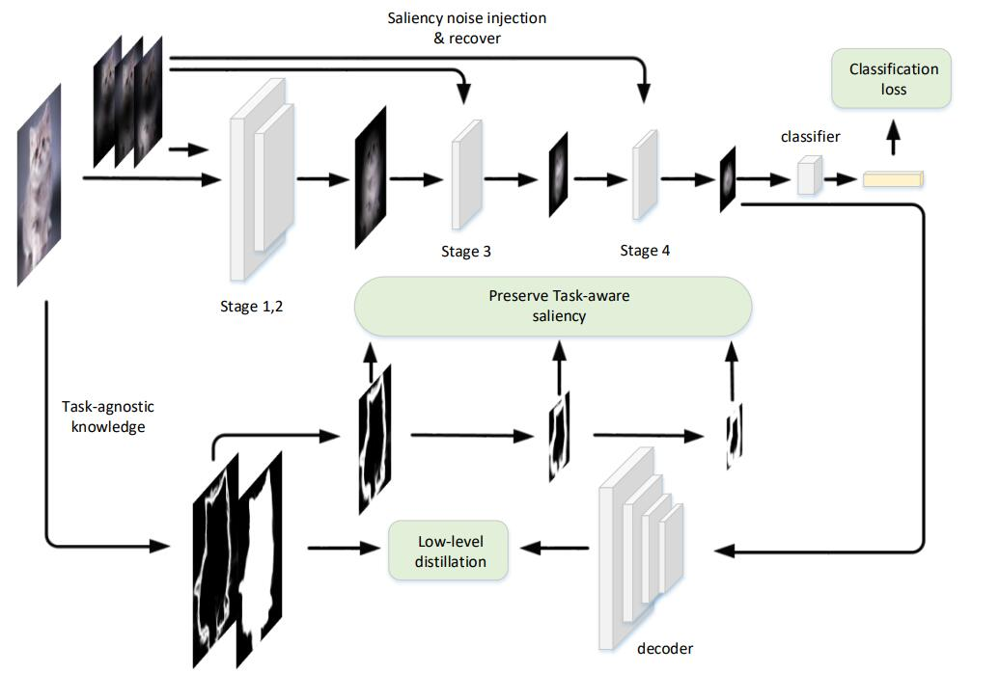

# TASS - Official Jittor Implementation



### [CVPR 2024] Task-Adaptive Saliency Guidance for Exemplar-free Class Incremental Learning

[Paper](https://arxiv.org/abs/2212.08251)

## Usage

* Training on CIFAR-100 dataset:
```bash
$ python main.py
```

## Low-level Map
You can download the pre-computed low-level map of [CIFAR-100](https://drive.google.com/file/d/1u1-67sNN8ED4PKOtdcy67mU3Dp9omv-8/view) and [Tiny-ImageNet](https://drive.google.com/file/d/1Jk9V0tdtkExZm60OW7wa2Q4PnEihPi2n/view?usp=drive_link) for your experiments.

## Pre-trained Models  
Download the pre-trained checkpoints on CIFAR-100:
- [5-phase Model](https://drive.google.com/file/d/1i3ANLwQ53Or2WLhijAAamFemLXdoO-QU/view?usp=drive_link)
- [10-phase Model](https://drive.google.com/file/d/1inlZQpjlDSNTmTVSVF_3kkLSp11vEOcM/view?usp=drive_link)
- [20-phase Model](https://drive.google.com/file/d/1ZRIj_X0DqnLNdcuZ9FvN8CQEm6AYHVEp/view?usp=drive_link)

## Citation
If you use this code for your research, please consider citing:
```bibtex
@article{liutask,
  title={Task-Adaptive Saliency Guidance for Exemplar-free Class Incremental Learning},
  author={Liu, Xialei and Zhai, Jiang-Tian and Bagdanov, Andrew D and Li, Ke and Cheng, Ming-Ming}
}
